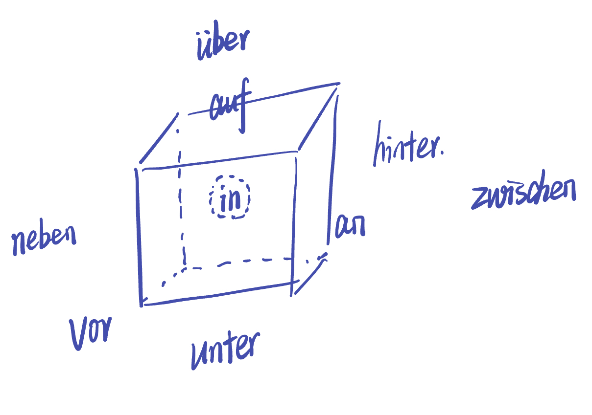
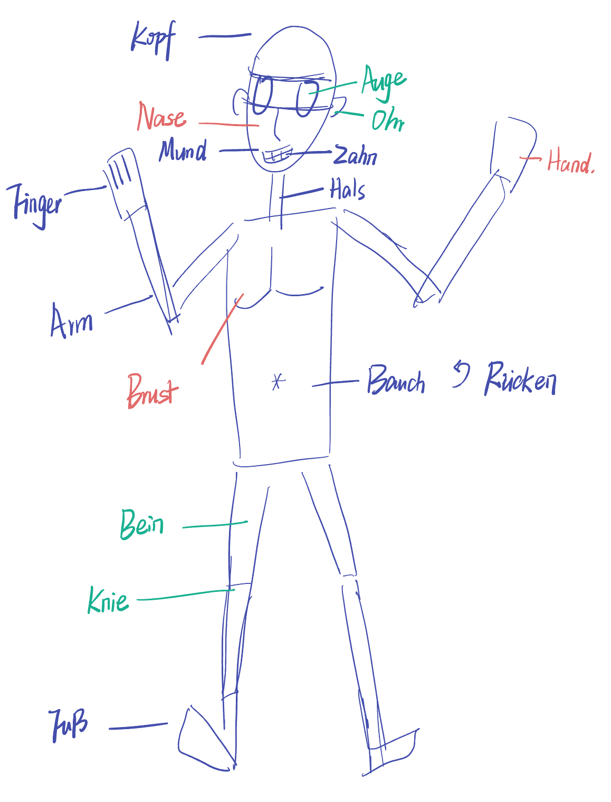
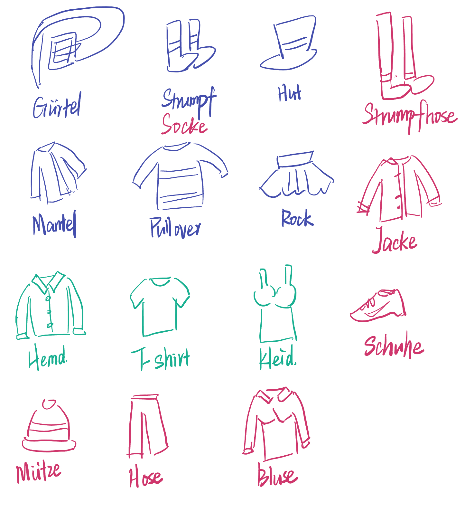
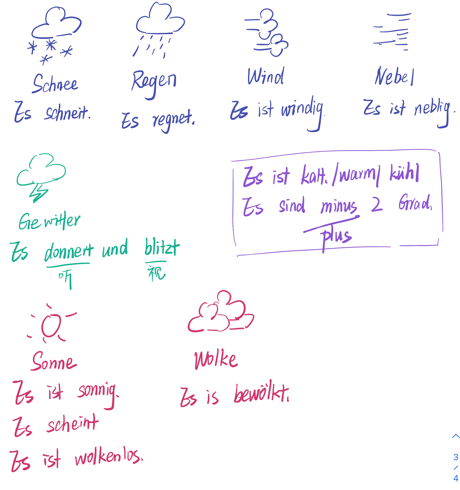

## 12. 积累词汇

### 12.1 问候

- Guten Tag/Morgen/Abend
- Gute Nacht
- Tschüs/Auf wiedersehen.

### 12.2 职业

- Ingenieur、Mechatroniker修理工、Schauspieler、Student、Lehrer、Verkäufer卖主
- 
- Journalistin、Freiseurin女理发师、Architektin、Sekretärin女秘书、Ärztin、Kellerin女服务员

### 12.3 家族

- Vater、Sohn、Bruder、Großvater、Opa、Enkel、Mann
- Mutter、Tochter、Schwester、Großmutter、Oma、Enkelin、Frau
- Eltern父母、Geschwister、Großeltern
- verheiratet已婚的

### 12.4 家具

- Sessel单人沙发、Stuhl、Tisch、Schrank、Teppich
- Bett、Bild、Sofa
- Lampe、Couch

### 12.5 物品

- Bleistift、Fotoapparat、Kugelschreiber圆珠笔、Schlüssel
- Buch、Feuerzeug
- Brille、Flasche、Kette、Tasche

### 12.6 物品-2

- Laptop、Drucker、Computer、Stift、Kalender、Bildschirm
- Handy、Telefon、Formular表格、Notizbuch
- E-Mail、SMS、Briefmarke邮票、Rechnung账单、Maus

### 12.7 运动

- kochen、singen、lesen、Feunde treffen、im Internet surfen、schwimmen、fotografieren、Fußball spielen、malen、backen、Musik hören、spazieren gehen散步、Schach spielen、Rad fahren

### 12.8 场所

- Kino、Theater、Museum、Café、Schiwimmbad、Konzert、Restaurant
- Ausstellung展览馆、Disco、Kneipe、Bar
- Etwas vorschlagen建议一些事、reagieren做出反应

### 12.9 食物

- Kuchen、Apfel、Tee、Braten烤肉、Fisch、Salat、Käse、Schinken培根
- Brot面包
- Kartoffel土豆、Schkolade、Suppe、Orange、Milch、Butter黄油、Tomate

### 12.10 交通工具

- Bahnhof、Flughafen、Bus、Zug、Bahnsteig站台、Koffer行李箱
- Taxi、Flugzeug、Gleis火车轨道、Gepäck行李
- S-Bahn轻轨、U-Bahn地铁、straßenbahn有轨电车、Tasche、Haltestelle停车点
- abholen迎接、anhufen打电话、einsteigen上车、aussteigen下车、ankommen达到、einkaufen采购

### 12.11 行为

- Hausaufgarben machen、E-Mails schreiben、fernsehen、einkaufen、schlafen、aufräumen整理
- arbeiten、eine Pause machen、Deutsch lernen、Zeitung lesen、Kaffe kochen
- die Reise旅行

### 12.12 季节

- Januar、Februar、März、April、Mai、Juni、Juli、August、September、Oktober、November、Dezember
- Frühling、Sommer、Herbst、Winter

### 12.13 空间方位

- in der Nähe 在附近、vorbeifahren 从旁驶过、zuhück回去

### 12.14 庭院

- Garten、Baum树、Balkon、erste Stock、Keller地下室
- Haus、Fenster、Erdgeschoss一楼
- Blume花、Treppe楼道、Garage

- glauben

### 12.15 建筑

- Turm钟楼、Markt、Laden货铺、Kindergarten、Spielplatz游乐场
- Schloss宫堡、Rathaus市政厅、Geschäft货铺
- Kirche教堂、Altstadt、Schule、Jungendherberge青年旅舍、Bibliothek

- wenig

### 12.16 常用物

- Aufzug、Fernseher、Bademantel、Föhn、Wecker闹钟
- Radio、Licht、Handtuch毛巾、Telefon、Wasser
- Klimaanlage空调、Heizung暖气、Internetverbindung、Seife肥皂、Dusche淋浴

- anmachen开、ausmachen关、vieleicht或许、vereinbaren约定

### 12.17 梦想、职业规划

- ein Buch schreiben、Chef werden、Schauspieler演员、Politiker
- Geld verdienen赚钱、eine große Familie haben、auf einen Berge steigen
- durch Europa reisen环欧旅行、um die Welt segeln环球旅行、im Ausland lieben
- viele Fremdsprachen lernen、den Führerschein machen考驾照、ein Instrument lernen

### 12.18 生病

- Doktor、Arzt医生、Husten咳嗽、Schnupfen喷嚏
- Rezept药方、Fieber发烧、Pflaster创口贴
- Apotheke药店、Praxis小诊所、Tablette药、Salbe膏药

- Medikamente药pl、Schmerzen痛、Leuten人们、natürlich当然
- Ich habe Kopfschmerzen.

### 12.19 外貌

- Bart

- lange、kurze、blonde金色、braume、schwarze、graue、glatte直 Harre，Locken卷发
- dick胖、schlank/dünn瘦、hübsch、hässlich
- erkennen辨认

### 12.20 家务

- Müll/Abfall rausbringen丢垃圾、Tisch decken、Boden wischen拖地
- Geschirr spülen/abwaschen洗餐具、Geschirr abtrocken、Bad putzen、Fenster putzen、Zimmer aufräumen、Bett machen
- Wäsche waschen、Wäsche aufhängen、Spülmaschine ausräumen

- bügeln熨衣服、schnell快的、sauber干净的、abholen迎接、

### 12.21 户外

- 
- 
- 

- Picknick machen、reiten骑马、zelten露营、telefonieren、Hunde mitnehmen、baden游泳、parken、grillen、Fahrrad fahren、angeln钓鱼、rauchen抽烟
- hupen按喇叭、Gurt安全带、anlegen对接、passieren发生

### 12.22 衣着

- zurzeit目前、diseses这
- Kleidung

### 12.23 天气

- Norden、Süden、Westen、Osten、Nordosten东北、schlecht坏的
- Wetter
- Hagel冰雹

### 12.24 节日

- Geburtstag、Karneval、Faschings狂欢节
- Weihnachten圣诞、Ostern复活节、Silvester跨年前、Neujahr
- Hochzeit婚礼、Einweihungsparty乔迁派对、Prüfung bestanden通过考试

- umgezogen、umziehen搬家、gleich一样、feiern庆祝

### 12.25 长辈、行为

- Teig面包、Cousin堂兄弟、Onkel、Neffe侄子、Schwiegervater岳父、
- Tante阿姨、Nichte侄女、Seite页
- Geschichten erzählen讲历史、draußen übernachten露营、auf Bäume klettern爬树、Fußballbilder sammeln收集足球图
- Sache auf dem Flohmarkt verkaufen从跳蚤市场买东西、Einrad fahren独轮车、Skateboard fahren、Comics lesen
- zeichnen绘画、Computerspiele spielen、mit Puppen spielen玩玩偶、süßigkeiten essen吃糖果、Witze erzählen讲笑话
- kompliziert复杂的=schwer und schwierig
- schloßen关闭、öffnen打开、schnell快的、besondere特殊的
- klappen=funktioneren顺利成功、verrückt疯狂的、streiten争吵
- Mist废话、schauen看、Quatsch胡说=kein Sinn无意义、schenken赠送、bestehen成功通过
- maskulin、neutrum、feminin

### 12.26 搬家

- Keller地下室、Dachboden阁楼、Boden地面、Mieter承租人、Tür门、Ecke角落、Kasten抽屉、Kühlschrank冰箱、Vorhang窗帘、Baumarkt建筑市场、Steinfußboden石板地面、Traum梦想、Möbelpacker家具搬运工、Geschmack爱好
- Regal书架、Klavier钢琴、Kissen枕头、Rügeleisen熨斗、Kompliment恭维、Werkzeug工具、Möbelstück家具、Ding物件、
- Wohngemeinschaft合租公寓WG、Dusche淋浴室、Kommode抽屉柜、Einrichtung布置、Wand墙、Actung注意、Bohrmaschine电钻、Dekoration装饰、Wiederholung复习、Sache事物、Pflanze植物
- weitermachen继续做、günstig好意的、umziehen搬家、versuchen尝试
- ausziehen拉出/搬出、einziehen关上/搬入、renovieren修缮、einrichten布置、diskutiehen讨论
- genau刚好、stimmen正确、vergleichen对照
- stellen放置、legen放、hängen悬挂
- stehen站、liegen躺、hängen悬挂
- dunkel昏暗的、hell亮的、aufpassen注意、wenig少的、Minimalismus简约风格
- wichtig重要的、gemütlich舒适的、verstehen理解、denken思考、meinen认为
- beides两个、traditionell传统的、modern

### 12.99 其它词汇

* 不定式
  * Infinitiv 不定时
  * Präsens 现在时 Präteritum 过去时 Perfekt 完成时
  * Imperativ 命令式
* 需要动词放在最后的
  * wollen、möchen、können、sollen、dürfen、müssen、würden
  * Schwester Angelika sagt, ich soll den Tee trinken.
  * Können Sie jeden Tag fernsehen?

[返回目录](../README.md) [上一节 11. 发音、常用语句](11-发音、常用语句.md) [下一节 11. 发音、常用语句](11-发音、常用语句.md)