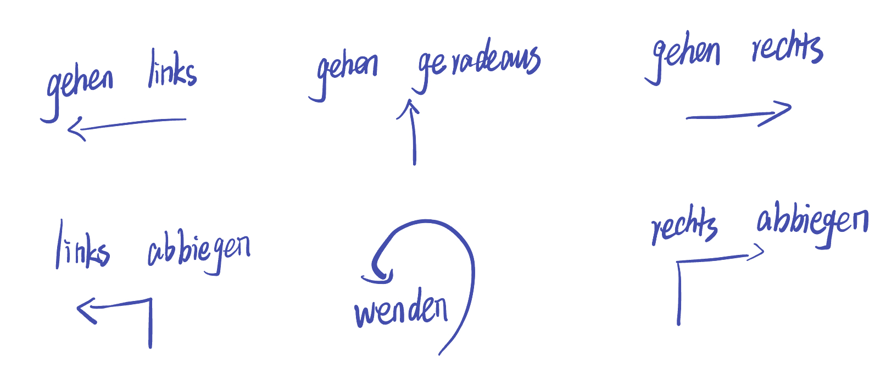

## 7. 介词 Präposition

### 7.1 空间方位

* 表示方位的介词+第三格Dativ

`über` 在上方不接触；`auf `在上方

`in` 在里面；`vor` 在前面；`hinter` 在后面；`zwischen` 在两者之间；`an` 贴在旁边；`neben` 在旁边

`unter` 在下方

立方体 Würfel；三棱锥 Pyramide；圆柱 Stab

* 例句（der Bahnhof）
  * Wo ist der Bahnhof?
  * Ich suche den Bahnhof.
  * Das Café ist vor dem Bahnhof. 表示方位的介词+第三格Dativ
* 方向（指路）
  * nach links / rechts
  * gehen geradeaus
  * links abbiegen / geradeaus gehen / rechts abbiegen
  * wenden
  * zwischen den Häusern
  * Gehen Sie die erste Straße links.
  * Gehen Sie an der Ampel vorbei.

### 7.2 时间范围

* in + Dativ
  * 回答Wann 什么时候 现在到未来的某个时刻
  * in einem Monat
  * Monat
  * Jahr
  * Stunde 小时
* vor + Dativ
* für + Akkusativ

zu bis 

* 工具

mit 相当于with ohne 相当于without

* 时间

ab

* 其它

als

* 要求第三格Dativ的介词

| 介词    | 含义                                                     |
| ------- | -------------------------------------------------------- |
| aus     | 从...中出来                                              |
| entlang | 沿着                                                     |
| mit     | 与...一起，在...时候，借助...                            |
| nach    | 到...方向                                                |
| von     | 从...来 （bis：从..至..；nach：到...方向；zu：到某人那） |
| zu      | 到...方向（国家、地名、方位）                            |

* 要求第四格Akkusativ的介词

| 介词 | 含义             |
| ---- | ---------------- |
| aus  | 到...为止        |
| für  | 为了；表持续时间 |
| ohne | 没有             |
| um   | 围绕；在...点钟  |

* 第三、四格共用的介词

| 介词     | 含义                        |
| -------- | --------------------------- |
| an       | 在...旁边（靠墙、紧贴之类） |
| auf      | 在...之上                   |
| hinter   | 在...之后                   |
| in       | 在...之中                   |
| neben    | 在...旁边                   |
| über     | 在...上边                   |
| unter    | 在...下边                   |
| vor      | 在...之前                   |
| zwischen | 在...之间                   |

[返回目录](../README.md) [上一节 副词](6-Adverb-副词.md) [下一节 小品词](8-小品词.md)
